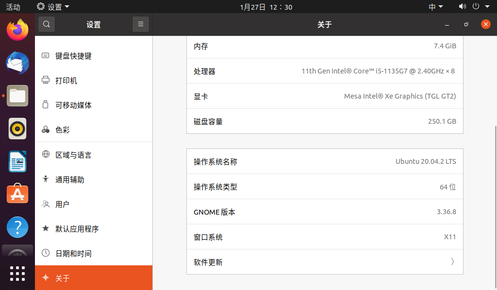

# CQUPT_Linux_Homework
* 2020级物联网工程操作系统的大作业,应该卓越工程师也是这个作业
* 开发环境用的**仙桃301实验室**的那台**NUC**，装的**Ubuntu 20.04**  

* Windows 通过SSH连接 Ubuntu 避免了双系统和虚拟机带来的麻烦  
* 推荐大家尝试一下**MobaXterm**，当时做智能车室外专项赛接触的，用了很久发现也挺爽，虽然比不上vscode直接拉取，但是稳定捏

* 开发板用的实验室的正点原子阿尔法板，注意需要修改板上系统，不然会一直卡在**version magic**  
* 其他注意事项看报告册吧，如果技术问题可以提个issure